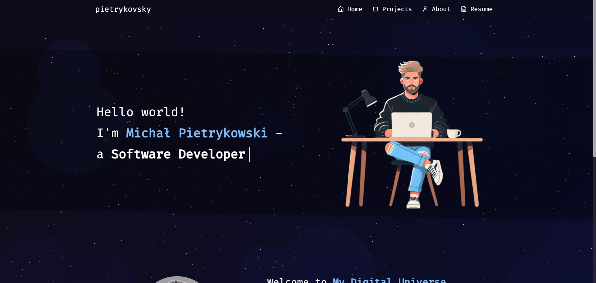

# Portfolio Website



## Demo
Check out the live demo: [pietrykovsky.duckdns.org](https://pietrykovsky.duckdns.org)

## Description
This project is a personal portfolio website built with Next.js and React Bootstrap. It showcases my projects, skills, and professional experience in a modern, responsive design.

## Features
- Responsive design using React Bootstrap
- Dynamic project showcase
- About me section with professional background
- Resume/CV page
- Particle.js background for visual appeal

## Technologies Used
- Next.js
- React
- React Bootstrap
- Docker
- Nginx (for deployment)
- Particle.js

## Prerequisites
- Node.js (v22)
- npm (v10)
- Docker and Docker Compose (for deployment)

## Local Development Setup
1. Clone the repository:
   ```
   git clone https://github.com/pietrykovsky/portfolio.git
   cd portfolio
   ```

2. Install dependencies:
   ```
   npm install
   ```

3. Run the development server:
   ```
   npm run dev
   ```

4. Open [http://localhost:3000](http://localhost:3000) in your browser to view the website.

## Deployment
This project is set up for deployment using Docker and Nginx as a reverse proxy.

1. Ensure you have Docker and Docker Compose installed on your server.

2. Clone the repository on your server.

3. Create a `.env` file in the project root and add any necessary environment variables.

4. Build and start the Docker containers:
   ```
   docker-compose up -d --build
   ```

5. The application should now be running on your server.

## Nginx Configuration
To configure Nginx as a reverse proxy for your portfolio:

1. Add the following server block to your Nginx configuration file:

   ```nginx
   server {
       listen 80;
       server_name yourdomain.com;

       location / {
           proxy_pass http://portfolio:3000;
           proxy_http_version 1.1;
           proxy_set_header Upgrade $http_upgrade;
           proxy_set_header Connection 'upgrade';
           proxy_set_header Host $host;
           proxy_cache_bypass $http_upgrade;
       }
   }
   ```

2. Replace `yourdomain.com` with your actual domain name.

3. If you're using Docker Compose for Nginx, make sure the portfolio network is included:

   ```yaml
   version: '3.9'
   services:
     nginx:
       # ... (existing configuration)
       networks:
         - portfolio_app-network
   
   networks:
     portfolio_app-network:
       external: true
   ```

4. Restart Nginx to apply the changes:
   ```
   docker-compose restart nginx
   ```

## SSL Certificate
To secure your website with HTTPS:

1. Ensure your domain is pointed to your server's IP address.

2. Use Certbot (running in the Nginx container) to obtain an SSL certificate:
   ```
   docker-compose exec nginx certbot --nginx -d yourdomain.com
   ```

3. Follow the prompts to complete the certificate installation.

## Customization
- Update the `src/app/page.js` file to modify the home page content.
- Edit `src/app/about/page.js` to update your about me information.
- Modify `src/app/projects/page.js` to showcase your projects.
- Update `src/app/resume/page.js` to reflect your current resume/CV.

## Contributing
Contributions, issues, and feature requests are welcome. Feel free to check [issues page](https://github.com/pietrykovsky/portfolio/issues) if you want to contribute.

## License
This project is licensed under the MIT License - see the [LICENSE](LICENSE) file for details.

## Acknowledgements
- [Next.js](https://nextjs.org/)
- [React Bootstrap](https://react-bootstrap.github.io/)
- [Particle.js](https://particles.js.org/)
- [Docker](https://www.docker.com/)
- [Nginx](https://www.nginx.com/)